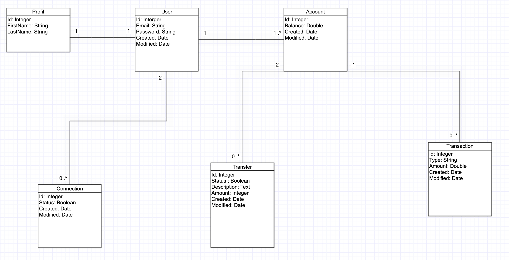
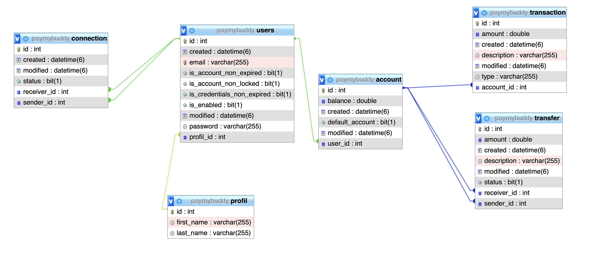

# Pay my Buddy

Pay my Buddy est une appli qui permettrait aux clients de transférer de l'argent pour gérer leurs finances ou payer leurs amis.

# Diagramme de classe

# Modele physique de donnée 

## Getting Started

Comment lancer le projet?

### Prerequisites

- Java 1.8
- Maven 3.6.1
- Mysql 8.0.19

### Installing

1. installez Java:

https://docs.oracle.com/javase/8/docs/technotes/guides/install/install_overview.html

2. installez Maven:

https://maven.apache.org/install.html

3. installez MySql:

https://dev.mysql.com/downloads/mysql/

### Running App

Après l'installation de MySQL, Java et Maven, vous devrez configurer les tables et les données dans la base de données. 
Pour cela veuillez importer le fichier sql payMyBuddy.sql présent dans le repertoire BD a la racine du projet.

Enfin, vous pouvez importer le code dans un IDE de votre choix et exécuter PayMyBuddyApplication.java pour lancer l'application.

### Testing

Pour exécuter les tests à partir de maven, accédez au dossier contenant le fichier pom.xml et exécutez la commande ci-dessous.

mvn test

### The final Jar file

mvn package jar tf target/pay-my-buddy.jar

